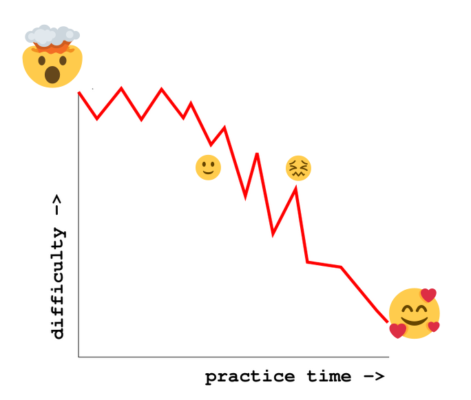

# Scraping with Python

## Homework
1. Write these scrapers again
2. Do the scraping from [datajournalism.com](https://datajournalism.com/watch/python-for-journalists)
3. Look for other scraping with Python and BeautifulSoup tutorials (for example this [one goes quite deeply](https://realpython.com/beautiful-soup-web-scraper-python/) into scraping)
4. Scrape. It can be whatever, just make sure it’s a website that is frequently visited. For example: scrape all the links to the weird preparations of fish in Scandinavian countries from the “See also” section of [wikipedia's entry for Hákarl](https://en.wikipedia.org/wiki/H%C3%A1karl)

## If it's too much
Try these plugins for chrome:
* [Webscraper](https://chrome.google.com/webstore/detail/web-scraper-free-web-scra/jnhgnonknehpejjnehehllkliplmbmhn): can scrape multiple pages
* [Scraper](https://chrome.google.com/webstore/detail/scraper/mbigbapnjcgaffohmbkdlecaccepngjd): handy for scraping simple table on just one site

---
* [get the presentation](tinyurl.com/pythonscraping2021)
